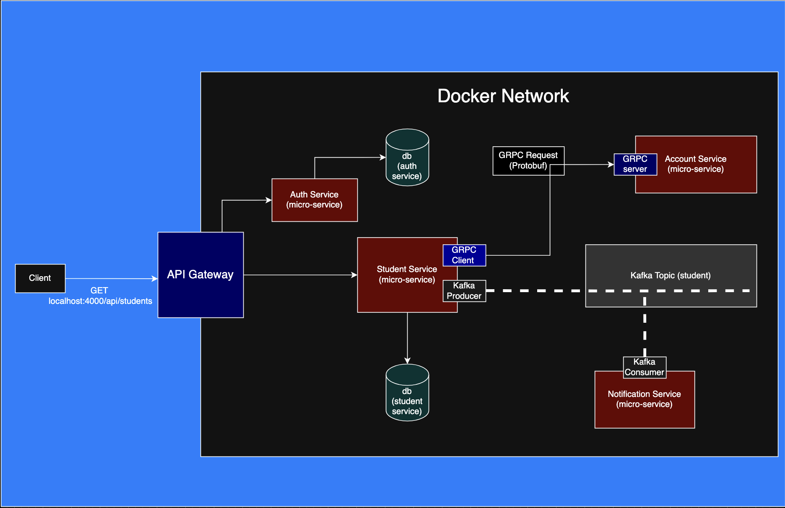

## Overview

A scalable microservices-based backend for managing students, accounts, and notifications. Built with Spring Boot, gRPC, Kafka, and API Gateway, this project demonstrates event-driven architecture, secure authentication, and inter-service communication.

## 🚀 Features

- API Gateway — Central entry point, handles authentication & routes requests
- Authentication Service — JWT-based authentication & user management
- Student Service — Create, update, delete, and fetch students
- Attendance Service (C#)- Manage students attendance
- Account Service — Handles account creation for new students (via gRPC)
- Notification Service — Listens to Kafka events and sends email notifications
- Event-Driven Architecture — Loose coupling via Kafka message broker
- Secure Communication — Auth validation before routing requests

## 🏗️ Architecture



## 🔑 Workflow Example

Client sends a POST /students request

API Gateway authenticates the request via Auth Service

Student Service creates a new student record

Student Service sends a gRPC request to Account Service to create the account

Student Service publishes a Kafka event (student.created)

Notification Service (Kafka consumer) receives the event & sends a welcome email

## 🛠️ Setup & Run

### 1️⃣ Clone the repository
```bash
git clone https://github.com/sudoMakeMeCoffee/student-management-microservices.git
cd student-management-microservices
```

### 2️⃣ Build and start all services with Docker Compose
```bash
docker-compose up -d
```

### 3️⃣ Check running containers
```bash
docker ps
```
